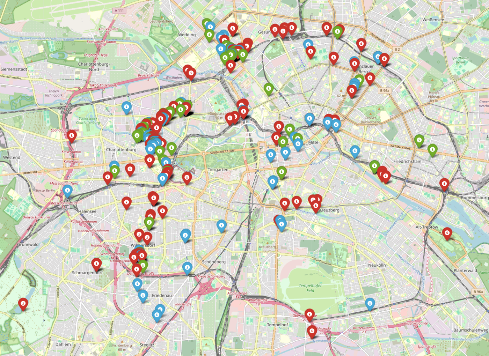
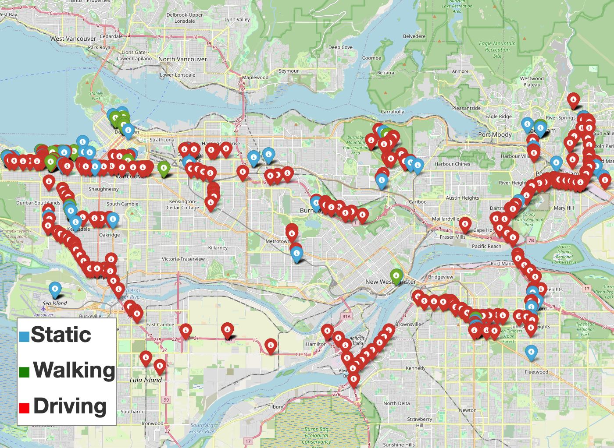

# [IFIP Networking '24] How Mature is 5G Deployment? A Cross-Sectional, Year-Long Study of 5G Uplink Performance

In this repository, we release the dataset and scripts used in the IFIP Networking '24
paper, *How Mature is 5G Deployment? A Cross-Sectional, Year-Long Study of 5G Uplink Performance*.

**Authors to Contact**:
[[Imran Khan](https://imranbuet63.github.io)]
[[Moinak Ghoshal](https://sites.google.com/view/moinak-ghoshal/home)] 
[[Sigrid Dimce]()]
[[Joana Anjo]()]
